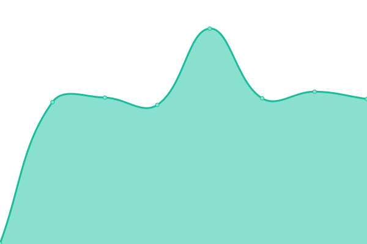
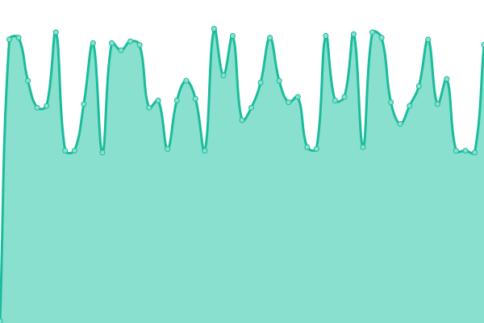

# [📈 Live Status](https://upptime.github.io/upptime): <!--live status--> **🟩 All systems operational**

This repository contains the open-source uptime monitor and status page for [Upptime](https://upptime.js.org), powered by [Upptime](https://github.com/upptime/upptime).

With [Upptime](https://upptime.js.org), you can get your own unlimited and free uptime monitor and status page, powered entirely by a GitHub repository. We use [Issues](https://github.com/upptime/upptime/issues) as incident reports, [Actions](https://github.com/LyoSU/upptimly/actions) as uptime monitors, and [Pages](https://upptime.github.io/upptime) for the status page.

<!--start: status pages-->
<!-- This summary is generated by Upptime (https://github.com/upptime/upptime) -->
<!-- Do not edit this manually, your changes will be overwritten -->
<!-- prettier-ignore -->
| URL | Status | History | Response Time | Uptime |
| --- | ------ | ------- | ------------- | ------ |
|  [Ly](https://lyo.su) | 🟩 Up | [ly.yml](https://github.com/LyoSU/upptimly/commits/HEAD/history/ly.yml) | 

 502ms
     
 | 

<a href="https://status.lyo.su/history/ly">100.00%</a>
    

|  [quote-api](https://bot.lyo.su/quote/generate) | 🟩 Up | [quote-api.yml](https://github.com/LyoSU/upptimly/commits/HEAD/history/quote-api.yml) | 

 623ms
     
 | 

<a href="https://status.lyo.su/history/quote-api">99.78%</a>
    

|  [hetzner](https://hz.lyo.su) | 🟩 Up | [hetzner.yml](https://github.com/LyoSU/upptimly/commits/HEAD/history/hetzner.yml) | 

 534ms
     
 | 

<a href="https://status.lyo.su/history/hetzner">99.79%</a>
    

|  mongo-hetzner | 🟩 Up | [mongo-hetzner.yml](https://github.com/LyoSU/upptimly/commits/HEAD/history/mongo-hetzner.yml) | 

 101ms
     
 | 

<a href="https://status.lyo.su/history/mongo-hetzner">100.00%</a>
    

|  oracle | 🟩 Up | [oracle.yml](https://github.com/LyoSU/upptimly/commits/HEAD/history/oracle.yml) | 

 94ms
     
 | 

<a href="https://status.lyo.su/history/oracle">100.00%</a>
    

<!--end: status pages-->

[**Visit our status website →**](https://status.lyo.su)

## 📄 License

- Powered by: [Upptime](https://github.com/upptime/upptime)
- Code: [MIT](./LICENSE) © [Upptime](https://upptime.js.org)
- Data in the `./history` directory: [Open Database License](https://opendatacommons.org/licenses/odbl/1-0/)
